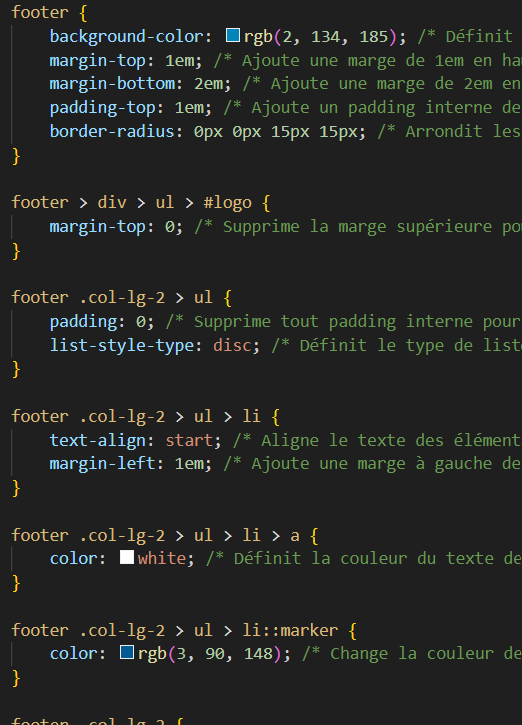

= Compte Rendu du DM CSS
:toc:

Luca KIUSI

== Liens

- Site : https://lucalk.github.io/DmCSS/
- GitHub : https://github.com/lucalk/DmCSS

== Introduction
Le projet avait pour but de faire une page HTML et d'y appliquer un style CSS pour que la page ressemble à cette page.

image::/imgCR/screen_2022.png[]

== 1. Body
Cela permet de retirer les soulignements des liens et les styles des listes.

image::imgCR/body.png[]

== 2. Header
=== Description
Le header contient le logo de l'application ainsi qu'un champ de recherche et son bouton.

Pour la mise en forme du header :

- Display flex et flex-wrap pour organiser le header et deplacer le contenu sur une nouvelle ligne si besoin.
- Justify-content pour appliquer un espace entre les éléments pour les placer aux extrémités du header.
- Margin-top pour appliquer un petit espace au dessus du header.

=== Final

== 3. Nav
=== Description
La navigation se compose d'une liste avec des liens principaux et des sous-liens.

Pour la mise en forme de la nav :

- col-lg-3 et col-md-3 pour définir la taille des colonnes en fonction de la taille de l'écran.
- Margin-top et margin-bottom pour appliquer un espace au-dessus et en dessous de la navigation, avec un fond de couleur bleu.
- Text-decoration pour supprimer le soulignement des liens.
- Display et flex-direction pour organiser le contenu en ligne, avec padding pour retirer les espaces internes.
- Bordure blanche et texte centré. Retirer tous les espaces pour occuper toute la largeur.
- Organisation des éléments avec un fond dégradé, des espaces internes, et une largeur automatique.
- Sous-liste : organisation en colonne, prenant toute la largeur et utilisant une autre police.
- Cacher les sous-listes de la liste principale.
- Apparition de la sous-liste lors du survol de l'élément de la liste principale.

=== Final

== 4. ul Solo
=== Description
La navigation se compose d'une liste permettant d'afficher la hiérarchie du site

Pour la mise en forme de ce ul :

- Color pour définir le texte en bleu et supprimer tous les espaces internes.
- Organisation du contenu en ligne et retrait des styles de liste.
- Liens non soulignés.

=== Final

== 5. Main
=== Description
Le main est composé d'un titre, une description et de 3 listes.

image::imgCR/mainHTML.png[]

Pour la mise ne forme du main :

- Aucun espace interne.
- Bordures arrondies avec un fond bleu, du texte en majuscule, et des espaces internes pour les éléments <h1>, <main>, et <aside>.
- Bordures transparentes arrondies avec des espaces internes et externes, ainsi qu'une ombre sous la boîte.
- Contenu centré avec une taille de police plus grande, sans soulignement, et avec des espaces internes.
- Organisation en colonne sans espace interne.

=== Final

== 6. Aside
=== Description
Le footer présente des informations légales et des liens utiles. :

Pour la mise ne forme du aside, j'ai utilisé :

- Bordures arrondies en haut avec un fond bleu, du texte en majuscule, et un espace interne.
- Listes organisées en colonne avec un alignement à gauche, et les sous-listes ayant un espace interne.
- Les textes ne sont pas soulignés et ont une couleur grise. Utilisation de text-align pour aligner les titres à droite.
- Les conteneurs sous les titres ont des coins arrondis et sont transparents.

=== Final

== 7. Footer
=== Description
Le footer est composé d'un logo est de listes possédants des sous-listes.

image::imgCR/footerHTML.png[]

Pour la mise ne forme du footer :

- col-lg-2, col-md-3, et col-mb-4 pour organiser le contenu en fonction de la taille de l'écran.
- Border-radius pour arrondir les bordures du footer, avec des espaces internes et externes.
- Style de liste pour rétablir les points de liste.
- Alignement des sous-listes à gauche, avec un espace externe.

=== Final

== 8. Responsive
===

